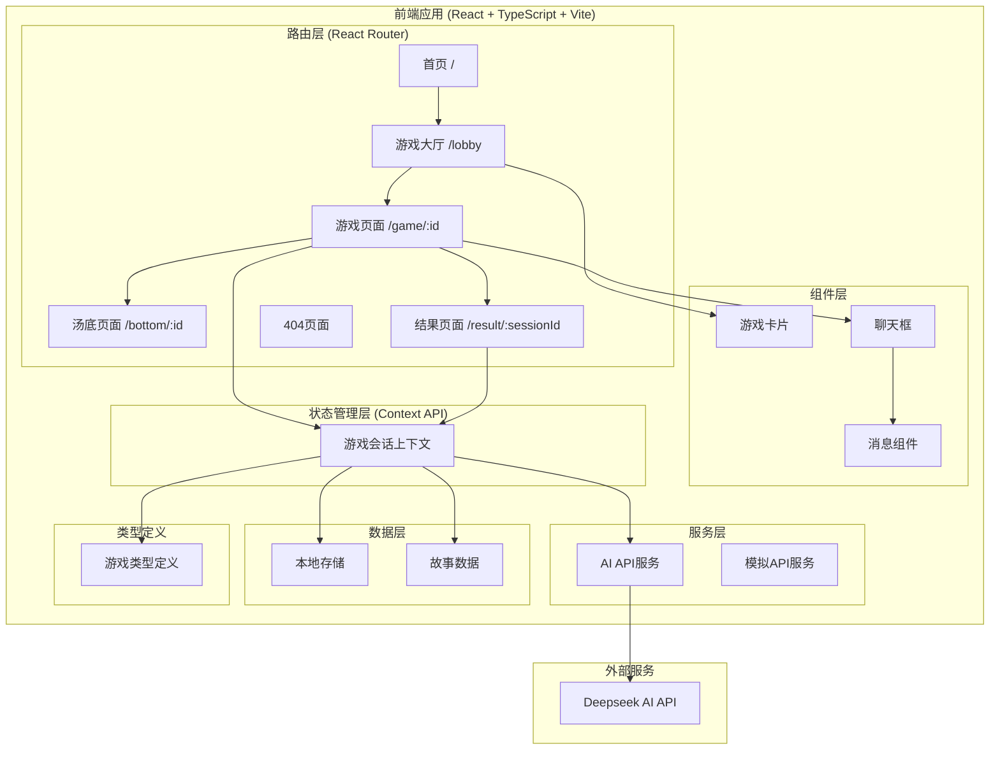
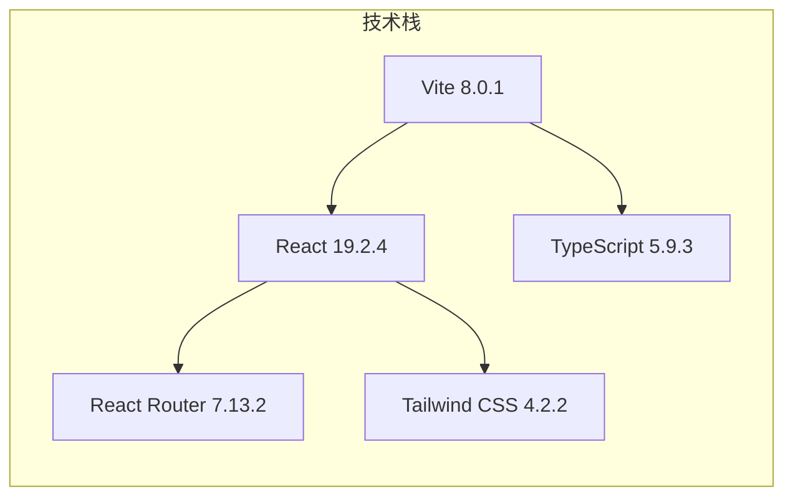
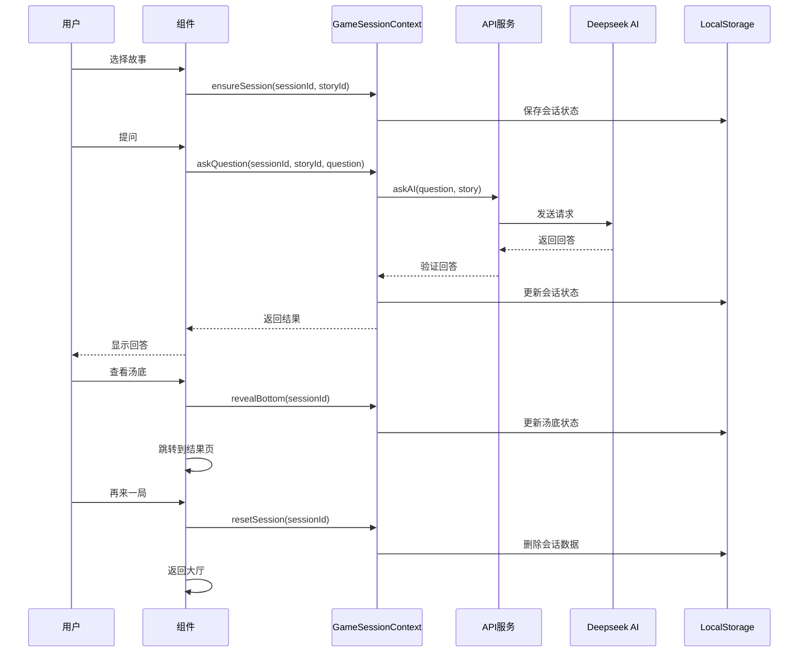
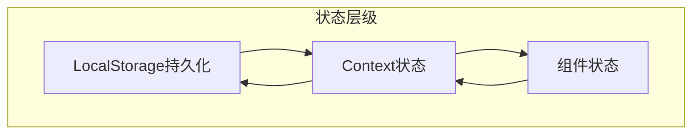
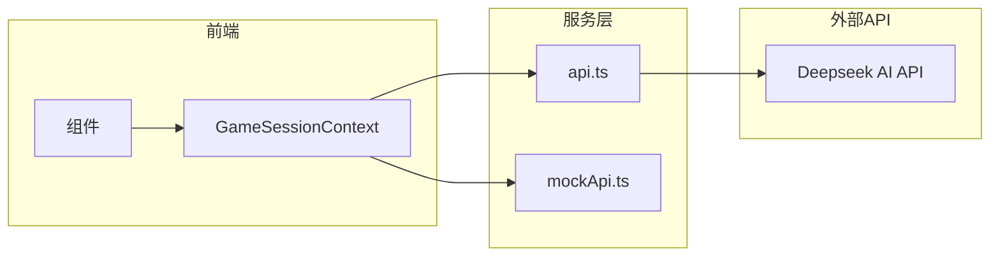
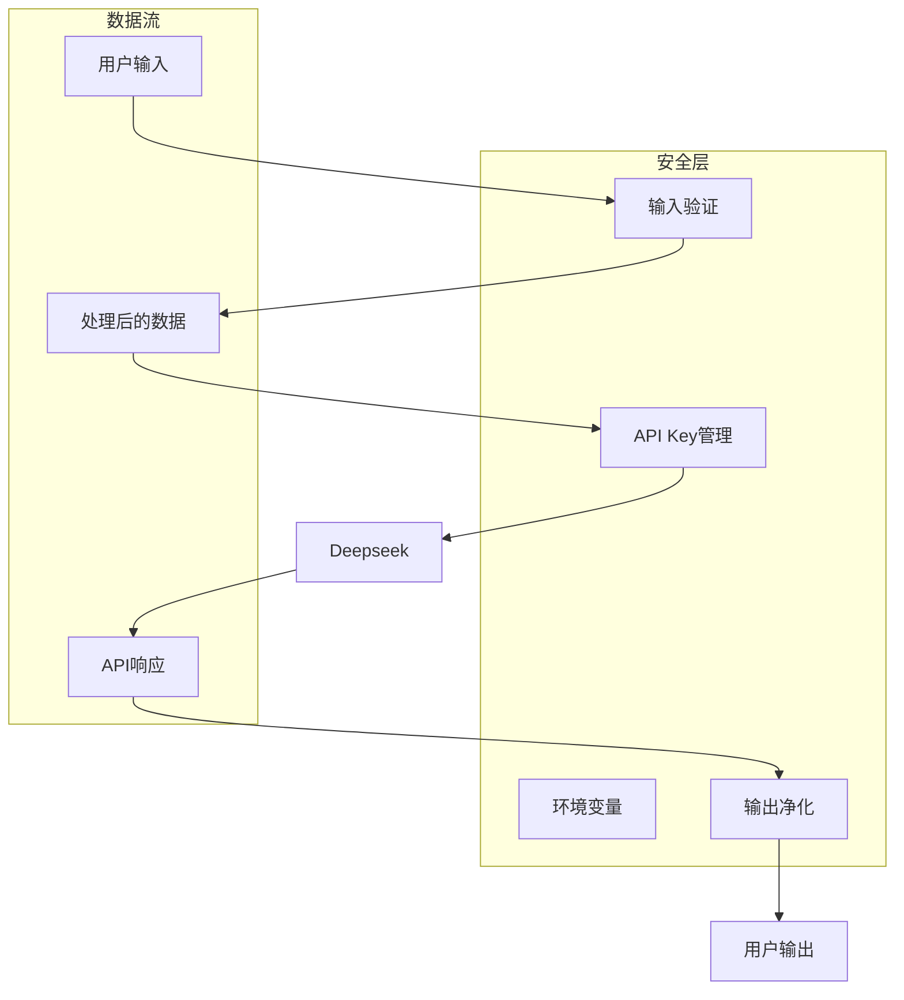
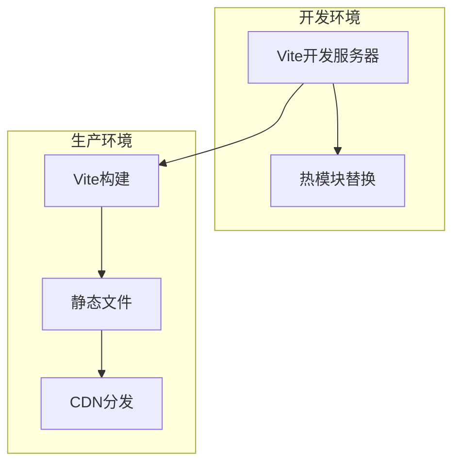

# AI 海龟汤游戏项目架构图

## 整体架构



## 技术栈架构



## 数据流架构



## 目录结构

```
ai-haigui-game/
├── frontend/                          # 前端项目
│   ├── public/                        # 静态资源
│   ├── src/
│   │   ├── components/                # 可复用组件
│   │   │   ├── ChatBox.tsx           # 聊天框组件
│   │   │   ├── GameCard.tsx          # 游戏卡片组件
│   │   │   └── Message.tsx           # 消息组件
│   │   ├── constants/                 # 常量定义
│   │   │   └── stories.ts            # 故事数据
│   │   ├── contexts/                  # React Context
│   │   │   └── GameSessionContext.tsx # 游戏会话管理
│   │   ├── pages/                     # 页面组件
│   │   │   ├── HomePage.tsx          # 首页
│   │   │   ├── LobbyPage.tsx         # 游戏大厅
│   │   │   ├── GamePage.tsx          # 游戏页面
│   │   │   ├── BottomPage.tsx        # 汤底页面
│   │   │   ├── ResultPage.tsx        # 结果页面
│   │   │   └── NotFoundPage.tsx      # 404页面
│   │   ├── services/                  # API服务
│   │   │   ├── api.ts                # AI API
│   │   │   └── mockApi.ts            # 模拟API
│   │   ├── types/                     # TypeScript类型
│   │   │   └── game.ts               # 游戏类型定义
│   │   ├── App.tsx                   # 根组件
│   │   ├── main.tsx                  # 入口文件
│   │   └── router.tsx                # 路由配置
│   ├── package.json                   # 项目配置
│   ├── vite.config.ts                 # Vite配置
│   └── tailwind.config.js            # Tailwind配置
├── AGENTS.md                          # 开发规范
├── PRD.md                             # 产品需求文档
└── TECH_DESIGN.md                     # 技术设计文档
```

## 核心功能模块

### 1. 游戏会话管理 (GameSessionContext)
- **职责**: 管理游戏会话状态
- **功能**:
  - 创建和初始化会话
  - 处理用户提问
  - 验证AI回答
  - 揭晓汤底
  - 重置会话
- **数据存储**: LocalStorage

### 2. 路由管理 (React Router)
- **首页**: 游戏介绍和开始按钮
- **游戏大厅**: 故事列表展示
- **游戏页面**: 汤面展示和问答交互
- **结果页面**: 汤底揭晓和游戏历史
- **汤底页面**: 汤底内容展示

### 3. AI集成
- **API**: Deepseek AI
- **回答验证**: 严格限制为「是」「否」「无关」
- **重试机制**: 非规范回答时的降级处理
- **超时处理**: 网络异常时的错误提示

### 4. UI组件
- **GameCard**: 故事卡片，展示故事信息
- **ChatBox**: 聊天界面，包含消息列表和输入框
- **Message**: 单条消息，支持用户和AI两种角色

## 状态管理架构



## API架构



## 安全架构



## 性能优化

1. **代码分割**: 使用React Router的懒加载
2. **状态优化**: 使用useMemo和useCallback
3. **本地缓存**: LocalStorage持久化会话状态
4. **组件复用**: 提取可复用组件
5. **样式优化**: Tailwind CSS按需加载

## 部署架构



## 扩展性设计

1. **模块化设计**: 组件和功能模块独立
2. **类型安全**: TypeScript完整类型定义
3. **配置化**: 故事数据可配置
4. **API抽象**: 服务层抽象，易于替换AI服务
5. **状态管理**: Context API可扩展为Redux/Zustand

## 监控与日志

1. **控制台日志**: 关键操作日志记录
2. **错误处理**: try-catch错误捕获
3. **用户反馈**: 错误提示和加载状态
4. **性能监控**: 开发环境性能分析
